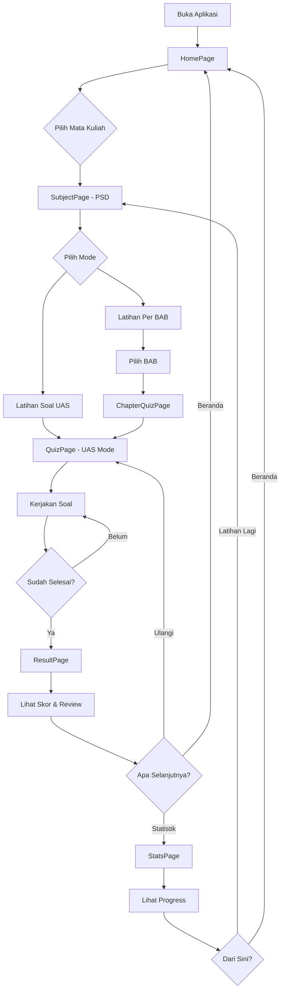

# 📚 ArtesionEdu — Aplikasi Latihan Soal Ujian

> **Clone Pahamify** untuk Mahasiswa Kecerdasan Buatan IPB University  
> Mata Kuliah: **Pengantar Sains Data (PSD)**

---

## 1. Visi & Tujuan

**Visi:** Menjadi platform latihan soal terbaik dan paling mudah digunakan oleh mahasiswa IPB khususnya jurusan Kecerdasan Buatan, dengan pengalaman mirip Pahamify — interaktif, engaging, dan progress-tracking.

**Tujuan:**
- Mahasiswa bisa latihan soal UAS dan per-BAB tanpa perlu login
- Progress tersimpan otomatis di browser (localStorage/cookies)
- Statistik performa terlihat jelas (akurasi, waktu, weak topics)
- Fully responsive — works on all mobile devices

---

## 2. Tech Stack

| Layer | Teknologi | Alasan |
|-------|-----------|--------|
| Framework | **Vite + React 18** | Fast dev, modern, easy deploy |
| Styling | **Tailwind CSS v4** | Utility-first, responsive cepat |
| Routing | **React Router v7** | SPA routing |
| State Mgmt | **Zustand** | Lightweight, localStorage persistence |
| Animasi | **Framer Motion** | Smooth transitions like Pahamify |
| Icons | **Lucide React** | Clean, consistent icons |
| Charts | **Recharts** | Statistik visual |
| Persistence | **localStorage + cookies** | Tanpa backend, data tetap aman |
| Deploy | **Static (Netlify/Vercel/GitHub Pages)** | Gratis, instant |

> **Tidak pakai backend** — semua data di client-side. Soal disimpan sebagai JSON/data files di repo.

---

## 3. Arsitektur Aplikasi

```
artesioneedu/
├── public/
│   └── favicon.svg
├── src/
│   ├── components/
│   │   ├── layout/
│   │   │   ├── Navbar.jsx
│   │   │   ├── BottomNav.jsx          # Mobile bottom nav (like Pahamify)
│   │   │   ├── PageContainer.jsx
│   │   │   └── AppShell.jsx
│   │   ├── home/
│   │   │   ├── HeroSection.jsx
│   │   │   ├── SubjectCard.jsx
│   │   │   └── QuickStats.jsx
│   │   ├── quiz/
│   │   │   ├── QuizCard.jsx           # Card soal
│   │   │   ├── OptionButton.jsx       # Pilihan jawaban A/B/C/D/E
│   │   │   ├── ProgressBar.jsx        # Progress bar atas
│   │   │   ├── QuizNavigation.jsx     # Next/Prev navigation
│   │   │   ├── TimerDisplay.jsx       # Optional timer
│   │   │   └── QuestionNumber.jsx     # Nomor soal indicator
│   │   ├── results/
│   │   │   ├── ScoreCircle.jsx        # Skor animasi (circle)
│   │   │   ├── AnswerReview.jsx       # Review jawaban benar/salah
│   │   │   ├── WeakTopics.jsx         # Topik yang lemah
│   │   │   └── ResultActions.jsx      # Ulangi / Lanjut buttons
│   │   ├── stats/
│   │   │   ├── StatsOverview.jsx      # Dashboard statistik
│   │   │   ├── AccuracyChart.jsx      # Chart akurasi
│   │   │   ├── TopicBreakdown.jsx     # Breakdown per BAB
│   │   │   ├── HistoryList.jsx        # Riwayat latihan
│   │   │   └── StreakCounter.jsx      # Streak hari latihan
│   │   └── ui/
│   │       ├── Button.jsx
│   │       ├── Card.jsx
│   │       ├── Badge.jsx
│   │       ├── Modal.jsx
│   │       ├── Toast.jsx
│   │       └── Confetti.jsx            # Celebration effect!
│   ├── pages/
│   │   ├── HomePage.jsx                # Beranda - pilih mata kuliah
│   │   ├── SubjectPage.jsx             # Detail MK - pilih mode latihan
│   │   ├── QuizPage.jsx                # Halaman mengerjakan soal
│   │   ├── ResultPage.jsx              # Hasil & review
│   │   ├── ChaptersPage.jsx            # Daftar BAB untuk latihan
│   │   ├── ChapterQuizPage.jsx         # Quiz per BAB
│   │   └── StatsPage.jsx               # Halaman statistik
│   ├── data/
│   │   ├── subjects.js                 # Data mata kuliah
│   │   ├── psd/
│   │   │   ├── chapters.js             # Daftar BAB PSD (8-12)
│   │   │   ├── quiz-uas.js             # Bank soal UAS (100 soal)
│   │   │   ├── bab-8-nonlinear.js      # Soal BAB 8 (30 soal)
│   │   │   ├── bab-9-ml-intro.js       # Soal BAB 9 (30 soal)
│   │   │   ├── bab-10-ml-lanjut.js     # Soal BAB 10 (30 soal)
│   │   │   ├── bab-11-shrinkage.js     # Soal BAB 11 (30 soal)
│   │   │   └── bab-12-storytelling.js  # Soal BAB 12 (30 soal)
│   │   └── ...
│   ├── stores/
│   │   ├── useQuizStore.js             # State management quiz
│   │   ├── useStatsStore.js            # State statistik & persistence
│   │   └── useUIStore.js              # UI state (theme, modal, etc.)
│   ├── hooks/
│   │   ├── useQuiz.js                  # Logic kuis
│   │   ├── useTimer.js                 # Timer logic
│   │   ├── useLocalStorage.js          # localStorage helper
│   │   └── useConfetti.js             # Confetti effect
│   ├── utils/
│   │   ├── shuffleArray.js             # Acak soal
│   │   ├── calculateScore.js           # Hitung skor
│   │   ├── formatTime.js               # Format waktu
│   │   ├── saveProgress.js             # Simpan progress
│   │   └── generateFeedback.js         # Generate feedback
│   ├── styles/
│   │   └── globals.css
│   ├── App.jsx
│   └── main.jsx
├── index.html
├── tailwind.config.js
├── vite.config.js
├── package.json
└── README.md
```

---

## 4. Fitur Utama (MVP)

### 🏠 **Beranda (Home)**
- Hero section dengan branding ArtesionEdu
- Card mata kuliah (PSD) dengan progress ringkas
- Quick stats: total latihan, akurasi rata-rata, streak
- CTA: "Mulai Latihan" yang prominent

### 📖 **Halaman Mata Kuliah (Subject Page)**
- Info mata kuliah: nama, deskripsi, jumlah BAB
- Dua mode utama:
  - 🔥 **Latihan Soal UAS** — campuran semua BAB, simulasi ujian
  - 📚 **Latihan Per BAB** — pilih BAB spesifik, fokus mendalam
- Link ke halaman Statistik

### 📝 **Halaman Kuis (Quiz Page)** — *Core Feature*
- **Soal tampil satu per satu** (tidak semua sekaligus)
- **ProgressBar** di atas menunjukkan posisi (contoh: 7/25)
- **Nomor soal navigable** — klik nomor untuk loncat
- **Pilihan jawaban A/B/C/D/E** dalam card yang tap-friendly
- **Select → highlight → konfirmasi** flow (bukan langsung jawab)
- **Warna feedback instan:**
  - ✅ Hijau = benar + penjelasan
  - ❌ Merah = salah + jawaban benar + penjelasan
- **Timer opsional** (bisa di-toggle off)
- **Auto-save** setiap jawaban ke localStorage
- **Swipe gesture** untuk next/prev (mobile)

### 📊 **Hasil & Review (Result Page)**
- **Score circle animasi** (seperti Pahamify) — persentase benar
- **Ringkasan:** X/Y benar, Z salah, waktu total
- **Review per soal:** scrollable list, warna-coded
- **Weak topics detection:** BAB mana yang perlu diperbaiki
- **Action buttons:**
  - "Ulangi Quiz"
  - "Ke Beranda"
  - "Lihat Statistik"

### 📈 **Statistik Pengguna (Stats Page)**
- **Dashboard overview:**
  - Total quiz diselesaikan
  - Rata-rata akurasi (%)
  - Total soal dijawab
  - **Streak** hari berturut-turut latihan
- **Chart akurasi over time** (line chart)
- **Breakdown per BAB** (bar chart) — mana yang kuat/lemah
- **Riwayat latihan** — list semua sesi dengan tanggal & skor
- **Reset data** option (dengan konfirmasi)

### 💾 **Persistence (Tanpa Login)**
- **localStorage** untuk:
  - Quiz progress (jawaban sementara)
  - Riwayat quiz yang sudah selesai
  - Statistik agregat
  - Preferensi pengguna
- **Cookies** untuk:
  - User ID unik (generated sekali, disimpan cookie)
  - Timestamp kunjungan terakhir (untuk streak)
- Data tidak hilang meski browser ditutup
- Export/import opsi (backup data)

---

## 5. UI/UX Design System (Pahamify-style)

### 🎨 Color Palette
```
Primary:     #6C63FF  (Ungu Pahamify-esque)
Secondary:   #4ECDC4  (Teal accent)
Success:     #06D6A0  (Hijau benar)
Danger:      #EF476F  (Merah salah)
Warning:     #FFD166  (Kuning warning)
Dark:        #1A1A2E  (Dark mode ready)
Light:       #FAFAFE  (Background)
Card BG:     #FFFFFF
Text Primary:#2D3436
Text Secondary:#636E72
```

### 📱 Responsive Breakpoints
```
Mobile:   < 640px   (primary target!)
Tablet:   640-1024px
Desktop:  > 1024px
```

### 🔤 Typography
- **Heading:** Inter/SF Pro Display — bold, clean
- **Body:** Inter — readable di mobile
- **Code/Math:** JetBrains Mono — untuk formula

### ✨ Micro-interactions (Pahamify vibes)
- Card hover: scale(1.02) + shadow
- Jawaban benar: confetti burst + checkmark animation
- Jawaban salah: shake animation + cross
- Page transitions: slide left/right
- Progress bar: smooth width transition
- Score circle: count-up animation
- Bottom nav: active indicator with bounce

---

## 6. Data Structure

### 📋 Format Soal (Question)
```javascript
{
  id: "psd-uas-001",
  bab: 1,                        // null untuk UAS (campuran)
  babTitle: "Pengantar Sains Data",
  question: "Apa definisi dari Data Science?",
  options: [
    { id: "a", text: "Proses mengumpulkan data saja" },
    { id: "b", text: "Interdisipliner ilmu yang mengekstrak insight dari data ✓" },
    { id: "c", text: "Cabang dari matematika murni" },
    { id: "d", text: "Teknik pemrograman web" },
    { id: "e", text: "Jenis database NoSQL" }
  ],
  correctAnswer: "b",
  explanation: "Data Science adalah bidang interdisipliner yang menggunakan metode ilmiah, proses, algoritma, dan sistem untuk mengekstrak pengetahuan dan insight dari data terstruktur maupun tidak terstruktur.",
  difficulty: "easy",            // easy | medium | hard
  tags: ["konsep", "definisi"]   // untuk analisis weak topics
}
```

### 📊 Format Statistik (Stored in localStorage)
```javascript
{
  userId: "anon_xxx",            // generated once, stored in cookie
  createdAt: "2025-01-15T...",
  stats: {
    totalQuizzesCompleted: 12,
    totalQuestionsAnswered: 287,
    totalCorrect: 198,
    averageAccuracy: 69.0,
    currentStreak: 5,
    longestStreak: 12,
    totalTimeSpent: 4500          // detik
  },
  history: [
    {
      id: "quiz_abc123",
      type: "uas",               // "uas" | "bab"
      subject: "psd",
      bab: null,                 // number atau null
      date: "2025-01-15T...",
      score: 78,
      correct: 19,
      total: 25,
      timeSpent: 1200,           // detik
      answers: [                 // review data
        { questionId: "...", selected: "b", correct: true, timeTaken: 24 }
      ]
    }
  ],
  preferences: {
    showTimer: true,
    showExplanationImmediately: true,
    darkMode: false
  }
}
```

---

## 7. Routing Map

```
/                    → HomePage (Beranda)
/subject/:subjectId  → SubjectPage (Detail MK - pilih mode)
/quiz/uas/:subjectId → QuizPage (Latihan UAS)
/quiz/bab/:subjectId/:babNum → ChapterQuizPage (Latihan per BAB)
/result/:quizId      → ResultPage (Hasil)
/stats               → StatsPage (Statistik)
/chapters/:subjectId → ChaptersPage (Daftar BAB)
```

---

## 8. Implementation Phases

### 🔴 **Phase 1: Foundation (Core MVP)**
- [ ] Setup project Vite + React + Tailwind
- [ ] Setup routing dasar
- [ ] Buat komponen UI dasar (Button, Card, Badge, Modal)
- [ ] Buat layout (Navbar + BottomNav + PageContainer)
- [ ] Implementasi localStorage persistence layer
- [ ] Buat data structure & sample data soal (min. 10 soal per BAB)
- [ ] HomePage dengan subject card
- [ ] SubjectPage dengan pilihan mode (UAS / Per BAB)

### 🟡 **Phase 2: Quiz Engine**
- [ ] QuizPage — render soal satu per satu
- [ ] Option selection dengan highlight & confirm flow
- [ ] Feedback visual (benar/salah + penjelasan)
- [ ] ProgressBar + question navigator
- [ ] Auto-save ke localStorage
- [ ] Timer (opsional, toggleable)
- [ ] Swipe gesture untuk mobile navigation
- [ ] Quiz completion → redirect ke result

### 🟢 **Phase 3: Results & Statistics** ✅ Done
- [x] ResultPage — score animasi (circle)
- [x] Review jawaban per soal (scrollable)
- [x] Weak topic detection
- [x] StatsPage — dashboard overview
- [x] Akurasi chart (line chart over time)
- [x] Breakdown per BAB (bar chart)
- [x] Riwayat latihan list
- [x] Streak counter logic
- [x] Reset data dengan konfirmasi

### 🔵 **Phase 4: Polish & UX** ✅ Done
- [x] Framer Motion animations (page transitions, micro-interactions)
- [x] Confetti effect saat skor tinggi
- [x] Dark mode toggle
- [x] Responsive polish (test di berbagai device)
- [x] PWA support (installable)
- [x] Export/import data
- [x] Loading states & error boundaries
- [x] Final QA & bug fixes

### 🟣 **Phase 5: Content & Launch**
- [x] Fokus soal pada BAB 8-12 sesuai materi PDF kuliah (30 soal/BAB)
- [x] Buat bank soal UAS campuran BAB 8-12 (100 soal)
- [x] Hapus soal BAB 1-7 dari aplikasi
- [x] Semua soal menggunakan format pilihan ganda (A/B/C/D)
- [x] Soal dirancang independen dan menguji pemahaman materi, bukan hafalan PPT
- [ ] Review & proofread manual semua soal dan penjelasan
- [ ] Deploy ke Netlify/Vercel
- [ ] Testing dengan user asli (mahasiswa KB IPB)

---

## 9. Soal Distribution Plan (PSD)

Berdasarkan file PDF yang ada, soal difokuskan pada BAB 8-12:

| # | BAB | Jumlah Soal | Format | Sumber |
|---|-----|------------|--------|--------|
| 8 | Regresi Nonlinear | 30 | Pilihan ganda | kuliah-08 nonlinear_regression.pdf |
| 9 | Pengenalan Machine Learning | 30 | Pilihan ganda | kuliah-09_pengenalan_machine_learning_slides.pdf |
| 10 | Supervised & Unsupervised Learning | 30 | Pilihan ganda | kuliah-10.pdf |
| 11 | Shrinkage Methods | 30 | Pilihan ganda | kuliah-11-shrinkage.pdf |
| 12 | Data Storytelling & Dashboarding | 30 | Pilihan ganda | kuliah-12-slides_storytelling_dashboard_peternakan.pdf |
| | **UAS (Campuran BAB 8-12)** | **100** | Pilihan ganda | Gabungan PDF BAB 8-12 |
| | **TOTAL** | **250** | | |

---

## 10. Diagram Alur Aplikasi



---

## 11. Prioritas & Scope MVP

### MVP Must-Have (Phase 1-3):
✅ Homepage dengan subject card
✅ 2 mode latihan: UAS + Per BAB
✅ Quiz engine (soal per soal, feedback, progress)
✅ Hasil dengan score animasi + review
✅ Statistik dashboard (akurasi, history, streak)
✅ localStorage persistence (tanpa login)
✅ Fully responsive (mobile-first)

### Nice-to-Have (Phase 4):
⭐ Dark mode
⭐ Confetti celebration
⭐ PWA installable
⭐ Timer
⭐ Swipe gestures
⭐ Export/import data

### Future (Post-MVP):
🔮 Tambah mata kuliah lain
🔮 Leaderboard (anonymous)
🔮 Soal essay/open-ended
🔮 Spaced repetition system
🔮 Backend + multi-user

---

## 12. Target Timeline

| Phase | Durasi | Deliverable |
|-------|--------|-------------|
| Phase 1 | 1-2 hari | Foundation + layout + sample data |
| Phase 2 | 2-3 hari | Quiz engine lengkap |
| Phase 3 | 1-2 hari | Results + Statistics |
| Phase 4 | 1-2 hari | Polish, animasi, responsive |
| Phase 5 | 2-3 hari | Content soal + deploy |
| **Total** | **~7-12 hari** | **Production ready** |

---

*Dibuat: 2025-06-17*  
*Diperbarui: 2026-06-17*  
*Status: 🟡 Phase 5 — Content Generated, Menunggu Review & Deploy*
